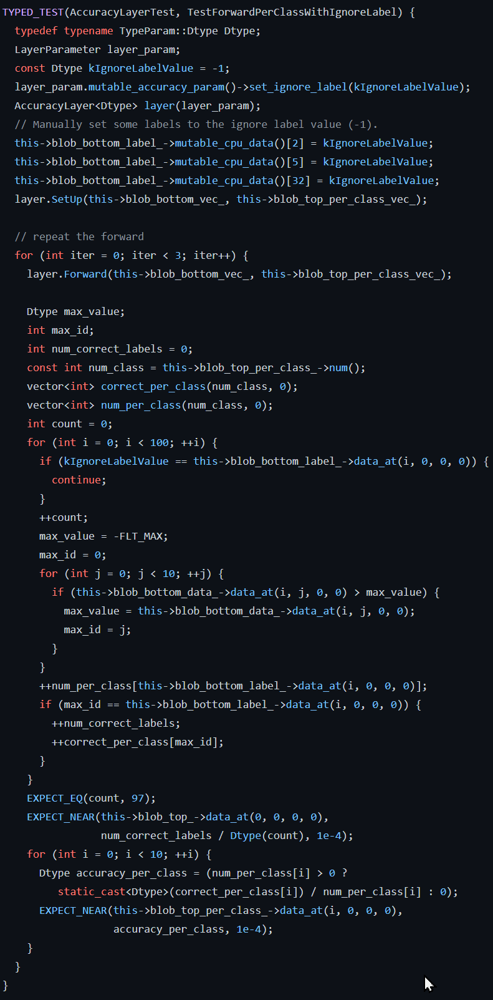

# Assessment of Caffe #
Written assessment of the deep learning framework "made with expression, speed,
and modularity." Caffe was developed by Berkeley AI Research (BAIR) in
association with The Berkeley Vision and Learning Center (BVLC) alongside
community contributors.

## Licensing ##
License is the BSD 2-Clause license.

The official [BSD 2-Clause license](LICENSE)

- The BSD 2-Clause license is a Permissive License which allows the author to
retain copyright for the purpose of disclaiming warranty and requiring
attribution of their software
- The Permissive License allows for any form redistribution and modification
- The license prevents me from relying on a software warranty to ensure the
software is working as intended and without fault

Caffe's license does not inhibit me from including their software in my senior
design project, but I will consider the ramifications of using software with a
BSD style license.

## Documentation ##
The documentation for the Caffe product is lacking. The code appears to be well
documented on the cover because the repository is decorated with a professional
README and a few other documents describing the process of installing, viewing
the documentation, building the application, and contributing to Caffe; however,
beneath the surface in the actual source code there exists little documentation
internally. The code is tightly compacted with no description for a new user.

Caffe claims to have created some official documentation supported by Jekyll for
the source, but I was not able to replicate the process described in the docs
as:

The official documentation is supported by Jekyll and can be made with

```
scripts/build_docs.sh
```

and the documentation can be viewed with

```
http://0.0.0.0:4000
```

Although the instructions for building the documentation are clear, I was unable
to view the documentation in my environment, perhaps due to unspecified
dependencies.

Contribution to Caffe is well-outlined in the documentation. Contribution is
laid out neatly for all developers with all requirements to contribute to the
software. The requirements for contribution even specify versioning, feature
branching, rebasing practices, and **testing**. While the standard is
acceptable, the source code is not. Caffe makes an emphasis on good software
development practices, yet the only standards upheld by the application are
feature branching and testing. Although the code has tests, the tests are not
documented well, rendering the tests useless. Inability to understand what is
being tested in the code is result of poor software development practices.
Caffe's documentation does not support my inclusion of their software into my
senior design project.

While the Caffe team claims to keep tutorials and examples documented close to
where they live there is little to no internal documentation found in the Caffe
source code. The code appears to have lots of tests written for it in the
source, but there is no documentation describing what any of the tests are
testing. At the surface the project appears to be well documented and
satisfactory of coding standard, but seeing the actual source code the Caffe
project does not appear to be well-documented. The claims made by the Caffe team
about their standards for contribution, coding style, and testing give the
appearance of a great software product; however, the source code yields a
different appearance. The source code is not well-documented, described, or
human readable. All of the code is difficult to understand and not "self-
describing."

The code appears to be littered with typos and many of the commit messages
indicate simple typing errors are being corrected with code spell checking
software, but the last actual update to the software which was not a pull
request to fix a typo was the addition of a "clip layer" to the software on Aug.
17, 2018. Nearly 2 years have passed since the last software update, which
indicates not only a lack of documentation, but a lack of support.

## Ease of use ##
1. 1 hour clone and use the application
- A detailed write-up about the install and build process of the application is
linked in the
[install documentation](http://caffe.berkeleyvision.org/installation.html)
- The write-up appears to be out of date because I was unsuccessful in cloning
and building the application (pre-compiled version work)
- Building Caffe on Windows appears to be impossible as the CUDNN8 software
used by Caffe is no longer supported

2. 1 day to make and run test suite
- unable to make the test suite because configuring the dependencies of the
software with Windows-Subsystem for Linux is very difficult as many of the
packages are not supported

3. 1 week to integrate with my application
- Caffe could be integrated successfully with any software application as the
software is no longer supports many of it's platforms due to lack of
maintenance
- Found a blog post on the Caffe community page describing how the software
can be built with external packages, but also could not get the external
packages to work; interestingly the blog post details other community members
having issues making and building the software on various platforms.

Community Channel

```
QUESTION:

artyom...@gmail.com
May 3, 2021, 3:26:49 AM (3 days ago)

Does Anybody know what happened to CAFFE?

I filled this pull request: https://github.com/BVLC/caffe/pull/7000 without it caffe even can't build with CUDNN8.

I understand that there is no new development but is there any change of maintenance?

Have anybody manages to continue some kind of updates of caffe maybe via forked repo?

Artyom


RESPONSE:

Tamas Nemes
May 3, 2021, 4:03:51 AM (3 days ago)

Hello Artyom,
Yes, it seems that Caffe was discontinued long ago, probably because there were too many issues and the devs couldn't keep up. But the community has managed to keep it up-to-date since than for today's software so it's possible to build Caffe for CUDA 11, CUDNN 8 and OpenCV 4. Have a look at this: https://github.com/Totemi1324/caffe-installation-guide In my opinion, this is the most detailed that you can use, it derives from this: https://qengineering.eu/install-caffe-on-ubuntu-20.04-with-opencv-4.4.html In both guides, you find the download-link for an up-to-date version of Caffe.
Hope you succeed with the installation!

Regards,
Tamas
```

The discontinuation of Caffe explains the lack of support and overall activity
from the developers in the project. The inability to use the product is likely to
result in not including Caffe in my senior design project.

## Support ##
While the Caffe product appears to be well supported via multiple community
channels, the channels are not well monitored and recent chats indicate issues
with maintenance in the software as indicated above. With further review the
commit logs and issue logs reinforce my suspicion about the software not being
well maintained. The version of Docker being used in Caffe is listed as 6 while
the most recent release of Docker is version 8, which indicates Caffe is more
than a few years out of date as Docker version 8 released in 2013. With further
investigation of the community channels many of the supported platforms appear
to have grown out date due to lack of maintenance and are losing support
(specifically Windows OS).

## Testing ##
Testing for Caffe is found under the sub-directory src/caffe/test. The magnitude
of files and documentation indicates the test suite is comprehensive, but with
further review the tests are found to have no internal documentation, are
unreadable, and non-descriptive. Here is an example of some of the source
found in the test files.



The tests may be comprehensive, but as described in "ease of use," I had no
success building the tests and can not read the source to identify if the tests
behave as they should in the application. For example, I can not make the tests,
change a line of code, and have a test which fails and points me to the line of
code changed to induce the failing test. The test suite is evidence of poor
software development, and does not give reason to include Caffe in my project.

## Dependencies ##
- Docker integration is Version 6 while the latest Docker release is version 8

As described in the software's dependency graph (may not be complete for
building the project). I been unable to successfully build the software,
potentially because of undocumented dependencies.

Note: Precompiled release is stable.

Dependencies defined in the python/requirements.txt
- cython / cython
- h5py / h5py
- ipython / ipython
- matplotlib / matplotlib
- networkx / networkx
- nose-devs / nose
- numpy / numpy
- pandas-dev / pandas
- python-pillow / Pillow
- protocolbuggers / protobuf
- paxan / python-dateutil
- google / python-gflags
- yaml / pyyaml
- scikit-image / scikit-image
- scipy / scipy
- benjaminp / six

Dependencies defined in the web_demo/requirements.txt
- pallets / flask
- numpy / numpy
- pandas-dev / pandas
- python-pillow / Pillow
- yaml / pyyaml
- tornadowed / tornado
- pallets / werkzeug

## Conclusion ##
I would not include Caffe in my senior design project because the software has
practically been discontinued. On the surface the software appears to have a
strong community with supporting documentation and good software development
standards, but realistically the software is not-well maintained, has no
internal documentation, and is full of unreadable code. Using the software to
integrate into a senior design project would be a poor design decision and
result in a lot of unnecessary headache for the project as indicated by a few of
the recent chats in the community channel.
